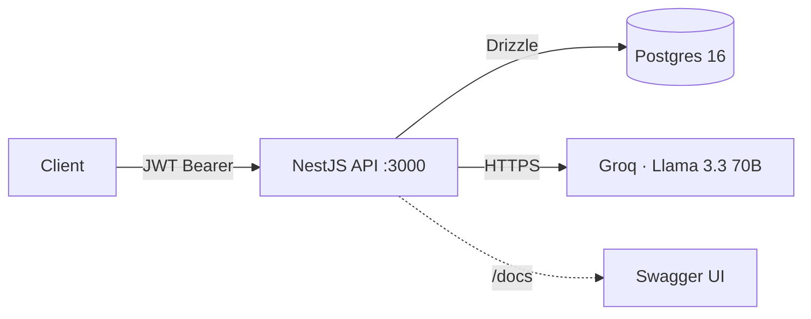

# NestAI Starter

[](https://nodejs.org)
[](https://www.typescriptlang.org)
[](https://nestjs.com)
[](https://www.postgresql.org)
[](./LICENSE)

Production-grade **NestJS + Postgres + Drizzle + JWT + Groq AI** starter. One command to boot — open the template, clone, `pnpm dev`, and you have a documented, tested, typed, auth'd API running in under a minute.

## Quick start

```bash
gh repo create my-backend --template FedeCione/nestai-starter --public --clone
cd my-backend
cp .env.example .env
pnpm install
pnpm dev
```

Then open [http://localhost:3000/docs](http://localhost:3000/docs) for Swagger UI.

`pnpm dev` spins up Postgres in Docker, runs migrations, and starts the API in watch mode — nothing else to configure.

## Architecture



## What's inside

- **NestJS 11** with strict TypeScript and a clean module layout (`auth`, `ai`, `common`, `config`, `database`, `health`).
- **Drizzle ORM** + `drizzle-kit` migrations, `postgres-js` driver. Schema at `src/database/schema.ts`.
- **Docker Compose** for local Postgres. `pnpm dev` boots the DB, runs migrations, and hot-reloads the API.
- **JWT auth** (`@nestjs/jwt` + Passport) with `bcrypt` password hashing (10 rounds).
- **Zod DTOs** with a tiny `ZodValidationPipe` — one source of truth for types *and* validation.
- **Groq SDK** for `/ai/generate`. Optional: with no `GROQ_API_KEY` set, the endpoint returns a canned demo response so the template runs out of the box.
- **Swagger UI** at `/docs` with persistent `Authorize` across reloads.
- **Helmet**, **CORS** allow-list, **origin check** middleware, and an **in-memory rate limit** guard (60 req/hour/identity by default).
- **Global exception filter** normalizes every error to `{ error: string, details?, resetIn? }`.
- **Vitest** suite — 11 unit tests and 7 HTTP e2e tests with a mocked DB, all green.
- **pnpm**, **ESLint flat config**, **Prettier**, **`@/*` path alias**.

## Endpoints

| Method | Path                | Auth | Description                                              |
| ------ | ------------------- | ---- | -------------------------------------------------------- |
| POST   | `/auth/register`    | –    | Create a user and return an access token                 |
| POST   | `/auth/login`       | –    | Exchange credentials for an access token                 |
| GET    | `/auth/me`          | JWT  | Return the authenticated user                            |
| POST   | `/ai/generate`      | JWT  | Generate a response from the configured LLM              |
| GET    | `/ai/generations`   | JWT  | List the last 20 generations for the authenticated user  |
| GET    | `/health`           | –    | Liveness probe (`{ status, uptime }`)                    |

## Error shape

All errors — from Zod, guards, services, or unhandled exceptions — are normalized by `HttpExceptionFilter`:

```json
{ "error": "invalid_credentials" }
{ "error": "invalid_payload", "details": [{ "path": "email", "message": "Invalid email" }] }
{ "error": "rate_limited", "resetIn": 42 }
```

| HTTP | `error`               | Emitted by                                  |
| ---- | --------------------- | ------------------------------------------- |
| 400  | `invalid_payload`     | `ZodValidationPipe`                         |
| 401  | `invalid_credentials` | `AuthService.login`                         |
| 401  | `unauthorized`        | `JwtAuthGuard`, `JwtStrategy`               |
| 403  | `forbidden`           | `OriginCheckMiddleware`                     |
| 409  | `email_taken`         | `AuthService.register`                      |
| 429  | `rate_limited`        | `RateLimitGuard` (includes `resetIn` secs)  |
| 503  | `ai_unavailable`      | `AiService.generate` on Groq failure        |
| 500  | `internal_error`      | Fallback for unhandled errors               |

## Environment variables

| Variable               | Required | Default                     | Notes                                                |
| ---------------------- | -------- | --------------------------- | ---------------------------------------------------- |
| `NODE_ENV`             | no       | `development`               | `development`, `test`, or `production`               |
| `PORT`                 | no       | `3000`                      |                                                      |
| `DATABASE_URL`         | **yes**  | –                           | Postgres connection string                           |
| `JWT_SECRET`           | **yes**  | –                           | Min 32 chars. `openssl rand -hex 32` to generate     |
| `JWT_EXPIRES_IN`       | no       | `15m`                       | Accepts any [`ms`](https://github.com/vercel/ms) duration |
| `GROQ_API_KEY`         | no       | –                           | Unset → `/ai/generate` runs in demo mode             |
| `GROQ_MODEL`           | no       | `llama-3.3-70b-versatile`   |                                                      |
| `RATE_LIMIT_WINDOW_MS` | no       | `3600000` (1h)              | Global rate-limit window                             |
| `RATE_LIMIT_MAX`       | no       | `60`                        | Requests per window per identity (user id or IP)     |
| `ALLOWED_ORIGINS`      | no       | `""`                        | Comma-separated origin allow-list; empty = same-origin |

Env is parsed through a Zod schema (`src/config/env.schema.ts`) at boot — misconfiguration fails fast with a readable error.

## Testing

```bash
pnpm test       # unit tests (Vitest)
pnpm test:e2e   # HTTP e2e tests (Vitest + supertest, DB mocked)
pnpm test:cov   # coverage
```

The e2e suite spins up a real Nest application with an in-memory DB mock — no Docker required. Unit tests cover the auth service, AI service (demo + live Groq + failure path), and the Zod validation pipe.

## Project layout

```
src/
├── app.module.ts             # Root module: filter, rate-limit guard, origin middleware
├── main.ts                   # Bootstrap: helmet, CORS, Swagger, shutdown hooks
├── auth/                     # Register/login/me, JWT strategy, guard
├── ai/                       # /ai/generate + /ai/generations, Groq client, demo fallback
├── common/
│   ├── filters/              # Global HttpExceptionFilter
│   ├── guards/               # RateLimitGuard
│   ├── helpers/              # getClientIp, zod-to-dto
│   ├── middleware/           # OriginCheckMiddleware
│   └── pipes/                # ZodValidationPipe
├── config/                   # env schema + NestConfigModule wiring
├── database/                 # Drizzle schema + module (DRIZZLE token)
└── health/                   # /health liveness probe
drizzle/                      # Generated SQL migrations (committed)
scripts/migrate.ts            # Idempotent migration runner (tsx)
docker-compose.yml            # Postgres 16 with healthcheck
```

## Extending this template

- **Real E2E with testcontainers.** The e2e suite mocks Drizzle at the module level. Swap that mock for a `@testcontainers/postgresql` container for true integration tests.
- **Refresh tokens.** Current auth issues access tokens only. Add a `refresh_tokens` table + `POST /auth/refresh` for long-lived sessions.
- **Swap LLM provider.** `AiService` hides Groq behind a thin constructor — replace with OpenAI, Anthropic, or Gemini SDKs without touching the controller.
- **Streaming responses.** `/ai/generate` returns a complete response. Switch to `Sse` or `res.write` to stream token-by-token.
- **Add a feature module.** Follow the `ai` module layout: controller + service + DTO + (optionally) a schema table.
- **Background jobs.** Add [`bullmq`](https://docs.bullmq.io) + Redis for queues; share the `DRIZZLE` token inside workers.
- **CI.** A minimal GitHub Actions pipeline (`lint + test + build` on push) is a good first PR.

## About the author / Sobre el autor

**EN** — Built by **Federico Cione**, a backend engineer from Argentina. I build typed, tested, AI-integrated backends for product teams. Available for **Backend MVP con IA** engagements (USD 1500–4000, 3–4 weeks). [Book a discovery call →](https://fedecione.dev#contact)

**ES** — Hecho por **Federico Cione**, desarrollador backend argentino. Construyo backends tipados, testeados y con IA integrada para equipos de producto. Disponible para paquetes **Backend MVP con IA** (USD 1500–4000, 3–4 semanas). [Agendá una llamada →](https://fedecione.dev#contact)

## License

[MIT](./LICENSE) © Federico Cione
